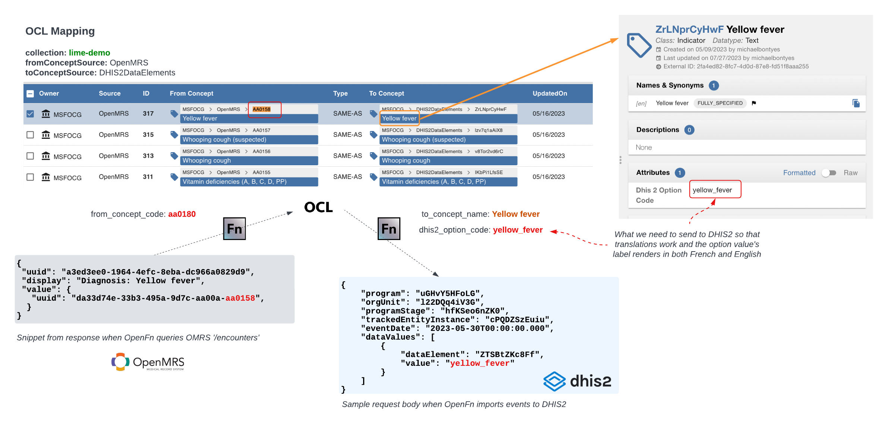

# OpenFn Prototype for MSF LIME Project

Automating data exchange workflows between `DHIS2`, `OpenMRS`, and `Open Concept Lab (OCL)`. 

*Note that commits to `main` will be auto-deployed to the connected project configuration hosted on OpenFn.org. Always work on a branch and submit a pull request when ready to release!*

## Working with the Repo

1. Clone the repo to work with it locally
2. Locally create `/tmp` folder locally with a `state.json` file that you don't commit to github
3. start writing and testing jobs locally with the relevant adaptor

## Prototype Design
To prototype automated data exchange workflows between MSF's global DHIS2 system and locally-deployed OpenMRS instances, we implemented the OpenFn DPG for this prototype--specifically the platform `v1` hosted on OpenFn.org. 

If MSF hopes to pilot this solution with real-world sites, then it may choose to locally deloy the `v2` of the OpenFn platform--OpenFn/Lightning. See below for what the proposed architecture might look like for this solution running at scale. 

## Workflows Implemented
For the `LIME-Project`, two workflows were prototyped. These workflows leverage the OpenFn `dhis2`, `openmrs`, and `ocl` adaptors (see [OpenFn/Docs](https://docs.openfn.org/adaptors)), and connect with demo instances of the target systems. 

### Specifications
- See below diagrams for a functional overview, or see [the diagrams](./diagrams) directory for the technical versions of these diagrams, which also detail the specific API steps. 
- See [this document](https://docs.google.com/spreadsheets/d/1jQyDKigzNUecK8cmxb0QonHvT_HZ6y950ReNRMVNQLo/edit#gid=426647407) for the data element mapping specifications, which detail how specific data points are mapped between systems. 
- See [this sheet](https://docs.google.com/spreadsheets/d/1PS6VFHRp3Jm-ikGdUz-ZFzz1IZgMFWfa1FHoWFsBSoU/edit) for the test cases used to validate the workflows. 

### Workflow 1: One-way migration of DHIS2 patients to OpenMRS for the initial setup

This workflow #1 is powered by by the following OpenFn jobs: 
- [wf1-1-getTEIs.j](./jobs/wf1-1-getTEIs.js) (using `dhis` adaptor)
- [wf1-2-createPatients.js](./jobs/wf1-2-createPatients.js) (using `openmrs` adaptor)
- [wf1-3-updateTEIs.js](./jobs/wf1-3-updateTEIs.js) (using `dhis2` adaptor)

See the [WF 1 technical diagrams](./diagrams/MSF-LIME%20OpenFn%20Workflow%201__vTECHNICAL.png) for documentation on the specific API endpoints and operations automated in the job code. 

### Workflow 2: Ongoing sync of new/updated OpenMRS data to DHIS2 for program monitoring & reporting 

This workflow #2 is powered by by the following OpenFn jobs: 
- [wf2-1-getPatients.js](./jobs/wf2-1-getPatients.js) (using `openmrs` adaptor)
- [wf2-2-upsertTEIs.js](./jobs/wf2-2-upsertTEIs.js) (using `dhis` adaptor)
- [wf2-3-getEncounters.js](./jobs/wf2-3-getEncounters.js) (using `openmrs` adaptor)
- [wf2-4-getOclMap.js](./jobs/wf2-4-getOclMap.js) (using `ocl` adaptor)
- [wf2-5-createEvents.js](./jobs/wf2-5-createEvents.js) (using `dhis` adaptor)

See the [WF 2 technical diagram](./diagrams/MSF-LIME%20OpenFn%20Workflow%202__vTECHNICAL.png) for documentation on the specific API endpoints and operations automated in the job code. 

#### Dynamically exporting mappings from OCL 
In Workflow 2, there is a step to dynamically export mapping specifications from OCL via its API. 
- See [this lime-project collection](https://app.openconceptlab.org/#/orgs/MSFOCG/collections/lime-demo/HEAD/expansions/autoexpand-HEAD/mappings/) on the OCL hosted app to view how mappings were configured. 
- See below diagram for an overview of how this works. For the prototype, this was implemented for the attributes `Entry triage color` and `Final diagnosis` (data that is collected when new OMRS `encounters` are created). 

## Questions? 
Contact support@openfn.org for questions or help. 
